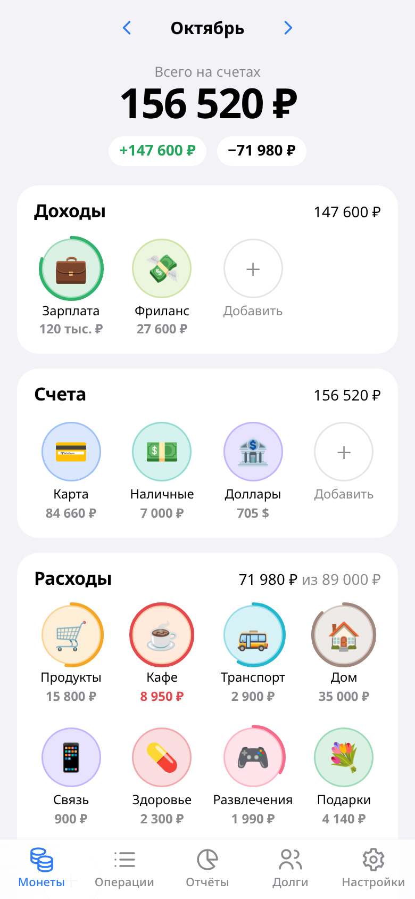
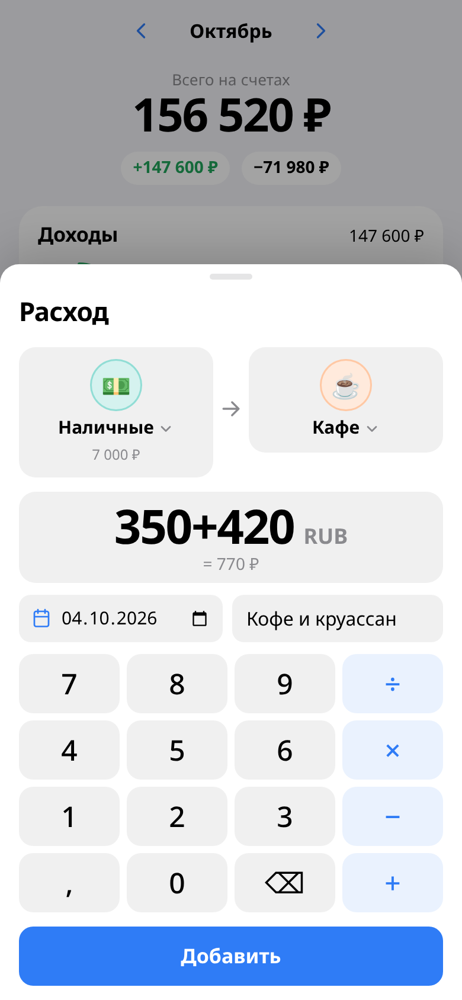
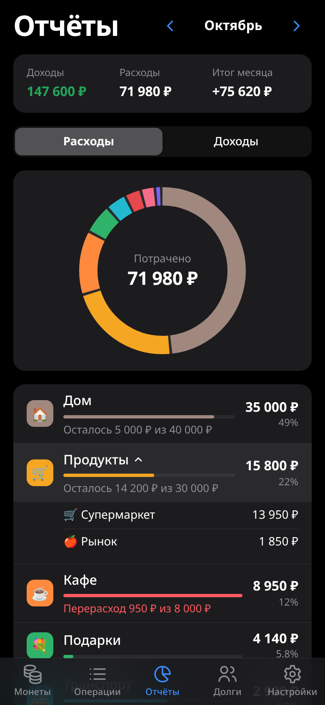
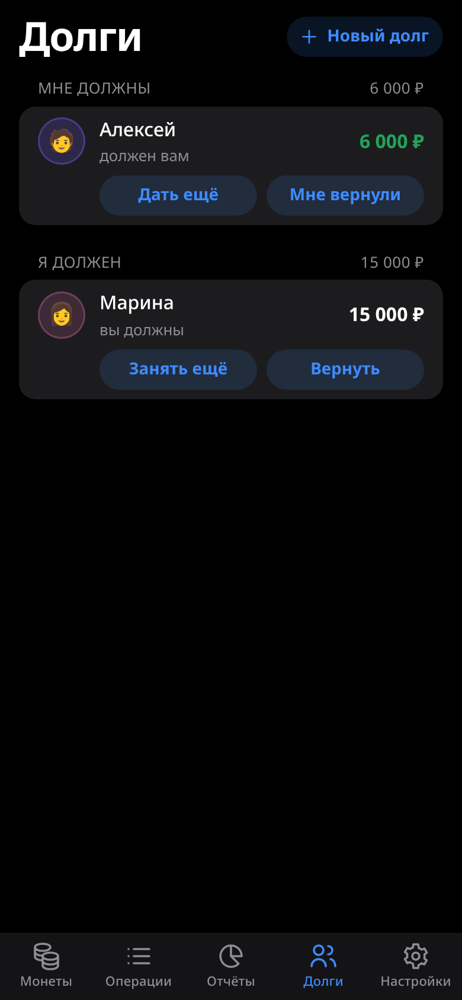

# 🪙 Coinly

**A personal finance tracker that lives inside Telegram as a Mini App.** Income sources, accounts and spending categories are coins. To record a transaction, drag one coin onto another: salary onto your card, the card onto "Groceries".

[](https://github.com/mbchl-code/coinly/actions/workflows/ci.yml)


<p align="center">
  
  
  
  
</p>

<p align="center"><b>Try it in Telegram: <a href="https://t.me/thecoinlybot">@thecoinlybot</a></b></p>

> The interface is in Russian. The screenshots use demo data.

## Features

- **Coins and drag & drop.** Long-press a coin and drag it: income onto an account, an account onto a category or another account. Tap a category to log an expense quickly.
- **Calculator in the amount field.** Type `350+420` or `1200×3`.
- **Monthly budgets.** A progress ring around each category coin turns red when you overspend.
- **Subcategories.** For example "Groceries → Market". Subcategory totals roll up into the parent.
- **Multiple currencies.** Each account has its own currency. Transfers between currencies record both amounts. Totals are shown in your base currency, with exchange rates fetched automatically or set by hand.
- **Debts.** Track who owes you and whom you owe. Lending and repayments go through an account, and the remaining balance is calculated for you.
- **History, reports, export.** Filter by transaction type, see a donut chart that drills down into subcategories, export to CSV.
- **Native-feeling interactions.** Every animation uses interruptible springs. Coins follow your finger 1:1, and sheets dismiss with a momentum-aware swipe. Haptic feedback, the native Back button, and colors and dark mode come from the user's Telegram theme. `prefers-reduced-motion` and `prefers-reduced-transparency` are respected.

## How it works

Coinly is a static app with no backend of its own.

- User data is stored in [Telegram CloudStorage](https://core.telegram.org/bots/webapps#cloudstorage), so it syncs across the user's devices. A copy is kept in `localStorage` so the app opens instantly.
- CloudStorage caps each value at 4 KB, so the state is split into chunks. Writes alternate between two slots (`a*` / `b*`) and then flip a `meta` pointer, which means an interrupted save never corrupts data. The quota fits roughly 20,000 transactions.
- Exchange rates come from the open [fawazahmed0/exchange-api](https://github.com/fawazahmed0/exchange-api), no API key required.

The data model is simple: there are **coins** (income source, account, category, debt) and **transactions** between them. The transaction type is derived from which kinds of coins it connects.

```
src/
  telegram.ts       typed wrapper around the Telegram WebApp API
  storage.ts        localStorage + CloudStorage (chunking, double buffering)
  store.tsx         useReducer state, autosave, exchange rates
  selectors.ts      balances, monthly totals, currency conversion
  utils/spring.ts   springs (damping/response), fling projection, rubber-banding
  components/       coins and drag & drop, bottom sheet, transaction entry, editor
  screens/          Coins · History · Reports · Debts · Settings
```

## Getting started

```bash
npm install
npm run dev      # http://localhost:5173, also works in a regular browser
npm run build    # type-check + production build into dist/
```

To try it inside Telegram on your phone, expose the dev server over HTTPS, for example with `cloudflared tunnel --url http://localhost:5173`, and give that URL to BotFather.

## Deployment

`dist/` is plain static files, so any HTTPS host will do. The repo includes a Docker image with nginx, TLS and sensible caching headers:

```bash
git clone https://github.com/mbchl-code/coinly && cd coinly
mkdir certs   # put fullchain.pem and key.pem here
COINLY_PORT=9443 docker compose up -d --build
```

If port 80 is taken, you can issue the certificate with a DNS-01 challenge. Example for DuckDNS using [acme.sh](https://github.com/acmesh-official/acme.sh):

```bash
export DuckDNS_Token=<your token>
acme.sh --issue --dns dns_duckdns -d <name>.duckdns.org
acme.sh --install-cert -d <name>.duckdns.org \
  --fullchain-file "$PWD/certs/fullchain.pem" \
  --key-file "$PWD/certs/key.pem" \
  --reloadcmd "docker exec coinly nginx -s reload"
```

## Connecting to Telegram

1. Create a bot with [@BotFather](https://t.me/BotFather) using `/newbot`.
2. Go to **Bot Settings → Configure Mini App → Enable Mini App** and enter the app's HTTPS URL. The app then appears in the bot's profile and opens via `t.me/<bot>?startapp`.
3. Optionally, set **Bot Settings → Menu Button** so the app opens from the button next to the message field.

No bot code is required: the Mini App runs entirely on the client.

## Roadmap

- [ ] Shared family budgets (needs a backend)
- [ ] Reminders from the bot
- [ ] Recurring transactions
- [ ] Weekly and custom-period budgets
- [ ] Export to a file

## License

[MIT](LICENSE)
